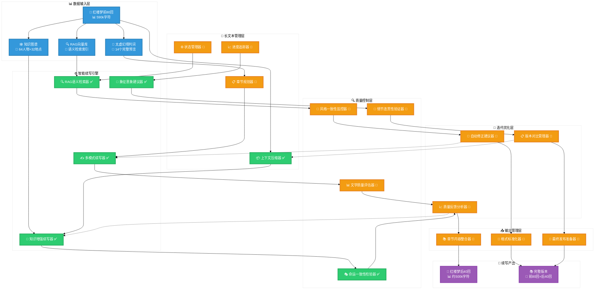
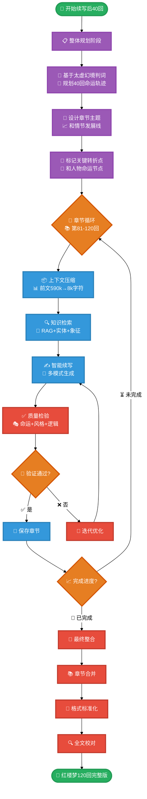
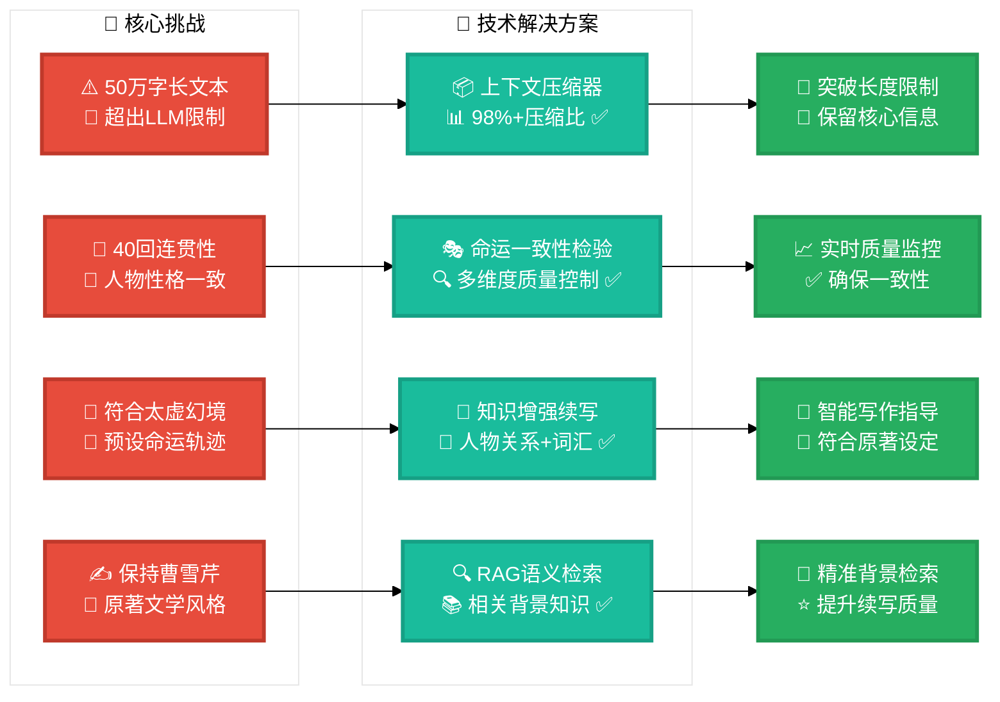

# AI续写红楼梦后40回项目

## 项目愿景

构建一个专门用于续写《红楼梦》后40回的AI系统，通过深度理解原著前80回的文学风格、人物性格、情节结构和太虚幻境预言，实现高质量、长篇幅的文学续写。

### 核心挑战与解决方案

#### 🎯 主要挑战
1. **长文本续写**: 后40回约50万字，远超LLM单次上下文限制
2. **一致性保持**: 人物性格、情节逻辑、写作风格的长期一致性
3. **命运符合**: 续写内容必须符合太虚幻境判词预设的命运轨迹
4. **文学质量**: 保持曹雪芹原著的文学水准和美学风格

#### 🚀 技术解决方案
- **分章节续写**: 将40回分解为管理单元，逐章推进
- **上下文管理**: 智能压缩和检索关键信息，突破长度限制
- **多层质量控制**: 实时监控一致性、合理性、文学性
- **迭代优化**: 基于反馈的持续改进机制

---

## 续写后40回系统架构

### 核心续写流水线
```
长篇续写管理系统
├── 📋 规划层 (Planning Layer)
│   ├── 章节结构规划器 📅 TODO
│   ├── 情节发展设计器 📅 TODO  
│   ├── 人物命运追踪器 ✅ (基于太虚幻境)
│   └── 写作进度管理器 📅 TODO
├── 🧠 智能续写引擎 (Writing Engine) 
│   ├── 上下文压缩器 ✅ 已实现 🆕
│   ├── 知识增强续写器 ✅ 已实现
│   ├── RAG语义检索器 ✅ 已实现
│   ├── 象征意象建议器 ✅ 已实现
│   └── 多模式续写器 ✅ 已实现
├── 🔍 质量控制层 (Quality Control)
│   ├── 命运一致性检验器 ✅ 已实现
│   ├── 风格一致性监控器 📅 TODO
│   ├── 情节连贯性验证器 📅 TODO
│   ├── 人物性格检查器 📅 TODO
│   └── 文学质量评估器 📅 TODO
├── 🔄 迭代优化层 (Optimization Layer)
│   ├── 反馈收集器 📅 TODO
│   ├── 质量分析器 📅 TODO
│   ├── 自动修正器 📅 TODO
│   └── 版本管理器 📅 TODO
└── 📤 输出管理层 (Output Layer)
    ├── 章节合并器 📅 TODO
    ├── 格式标准化器 📅 TODO
    ├── 最终校对器 📅 TODO
    └── 发布准备器 📅 TODO
```

### 系统架构全景图



### 长文本续写核心流程



### 关键技术突破点



---

## 已实现的核心能力 ✅

### 🏗️ 基础设施 (完成度: 90%)
- [x] **数据处理管道**: 前80回完整解析，590k字符知识库
- [x] **知识图谱**: 64个人物、32个地点、289个专用词汇  
- [x] **太虚幻境系统**: 14个完整判词，命运预言结构化
- [x] **RAG检索系统**: Qwen3向量化，四种智能检索模式

### 🎨 文学理解能力 (完成度: 95%)
- [x] **知识增强续写**: 实体、关系、词汇的智能检索和建议
- [x] **命运一致性检验**: 基于判词的多维度质量控制
- [x] **象征意象建议**: 67个文学象征的智能推荐
- [x] **多模式续写**: 基础、对话、场景、诗词四种专业模式

### 🔧 技术架构 (完成度: 90%)
- [x] **LangChain统一架构**: 代码量优化40%，维护性大幅提升
- [x] **CLI工具集**: 完整的命令行接口和批量处理
- [x] **API接口**: Python编程接口和扩展能力
- [x] **容错机制**: 优雅降级和错误恢复

---

## 待开发模块 (续写后40回专用)

### 🎯 高优先级 (P0)
- [ ] **长文本续写管理器**
  - [x] 上下文压缩算法 (解决长度限制) ✅ 已实现
  - [ ] 章节间信息传递机制
  - [ ] 进度跟踪和状态管理
  - [ ] 智能断点续写功能

- [ ] **章节结构规划器**  
  - [ ] 基于判词的40回整体规划
  - [ ] 情节发展时间线设计
  - [ ] 关键事件和转折点标记
  - [ ] 人物出场和退场安排

### 🔍 中优先级 (P1)
- [ ] **风格一致性监控器**
  - [ ] 文风相似度实时检测
  - [ ] 语言风格自动调整
  - [ ] 修辞手法使用指导
  - [ ] 诗词化程度控制

- [ ] **情节连贯性验证器**
  - [ ] 逻辑关系检查
  - [ ] 时间线一致性验证  
  - [ ] 空间关系合理性
  - [ ] 因果关系追踪

### 🚀 低优先级 (P2)
- [ ] **协作续写平台**
  - [ ] 多人协作接口
  - [ ] 专家评审系统
  - [ ] 读者反馈收集
  - [ ] 版本对比分析

---

## 技术实现路线图

### 🚀 第一阶段 (3个月) - 长文本续写基础
```python
核心任务：
├── 上下文管理系统开发
├── 章节规划器实现  
├── 长文本续写流水线搭建
└── 基础质量控制集成
```

### 📈 第二阶段 (4个月) - 质量控制完善  
```python
核心任务：
├── 风格一致性监控器
├── 情节连贯性验证器
├── 自动化质量评估系统
└── 迭代优化机制
```

### 🎯 第三阶段 (3个月) - 实际续写与优化
```python
核心任务：
├── 前5回试写验证
├── 系统性能优化
├── 质量反馈循环
└── 最终系统集成
```

---

## 关键技术突破点

### 🧠 上下文管理策略
```python
class LongTextContextManager:
    """长文本上下文智能管理器"""
    
    def compress_context(self, previous_chapters):
        """压缩前文关键信息"""
        # 提取人物状态、情节要点、重要对话
        pass
    
    def retrieve_relevant_info(self, current_context):
        """检索相关背景信息"""
        # RAG + 知识图谱双重检索
        pass
    
    def maintain_consistency(self, new_content):
        """维护一致性检查"""
        # 实时检验人物、情节、风格一致性
        pass
```

### 📋 章节规划算法
```python
class ChapterPlanningEngine:
    """40回章节规划引擎"""
    
    def generate_overall_plan(self):
        """生成整体规划"""
        # 基于太虚幻境判词的命运轨迹规划
        pass
    
    def design_chapter_outline(self, chapter_num):
        """设计单章大纲"""
        # 情节发展、人物安排、重点事件
        pass
    
    def track_progress(self):
        """跟踪写作进度"""
        # 完成度、质量指标、时间管理
        pass
```

---

## 项目数据概览

| 指标类别 | 当前成果 | 续写目标 |
|---------|---------|---------|
| **文本规模** | 590k字符(前80回) | +500k字符(后40回) |
| **章节数量** | 80章已处理 | 40章待续写 |
| **人物覆盖** | 64个主要人物 | 完整命运闭环 |
| **判词覆盖** | 14个完整解析 | 100%命运实现 |
| **技术模块** | 29个功能模块 | +14个续写专用 |

---

## 快速开始

### 🔧 环境设置
```bash
# 安装依赖
pip install -r requirements.txt

# 初始化数据
python main.py data process

# 构建RAG知识库  
python main.py rag build
```

### 📝 续写测试
```bash
# 知识增强续写
python main.py enhanced-continue -c "宝玉回到贾府" -t basic

# 命运一致性检验
python main.py fate-check -t "续写文本内容"

# 象征意象建议
python main.py symbolic-suggest -c "林黛玉" --tone "melancholy"
```

### 🚀 开发新模块
```python
# API接口使用
from ai_hongloumeng import PromptTemplates, get_knowledge_retriever

# 启用完整增强功能
templates = PromptTemplates(enable_knowledge_enhancement=True)
retriever = get_knowledge_retriever()

# 生成增强提示词
enhanced_prompt = templates.get_enhanced_prompt(
    context="续写内容上下文",
    prompt_type="basic"
)
```

---

## 📊 架构图视觉优化说明

### ✅ **新增优化特性**
- **🎨 高对比度配色**: 白底黑字，确保各种显示环境下的清晰度
- **🔧 主题配置**: 明确的base主题设置，避免dark mode显示问题  
- **📐 增强边框**: 3px边框宽度，模块区分更加明显
- **🎯 图标丰富**: 每个模块增加专属图标，提升视觉识别度
- **🌈 色彩语义**: 5种颜色分别代表不同功能状态和优先级

### 🎨 **颜色方案说明**
| 颜色 | 含义 | 适用模块 |
|------|------|----------|
| 🔴 **红色** | 核心挑战 | 长文本限制、一致性难题 |
| 🟢 **绿色** | 已实现 | RAG检索、知识增强、命运检验 |
| 🟠 **橙色** | 待开发 | 规划器、监控器、优化器 |
| 🔵 **蓝色** | 数据输入 | 知识库、图谱、向量库 |
| 🟣 **紫色** | 最终产出 | 后40回、完整版本 |

---

*最后更新: 2025-07-23*  
*项目状态: 基础架构完成，长文本续写模块开发中*  
*技术栈: LangChain + Qwen3 + Claude-4 + 太虚幻境知识库*  
*架构图优化: 高对比度设计，适配多种显示环境*
